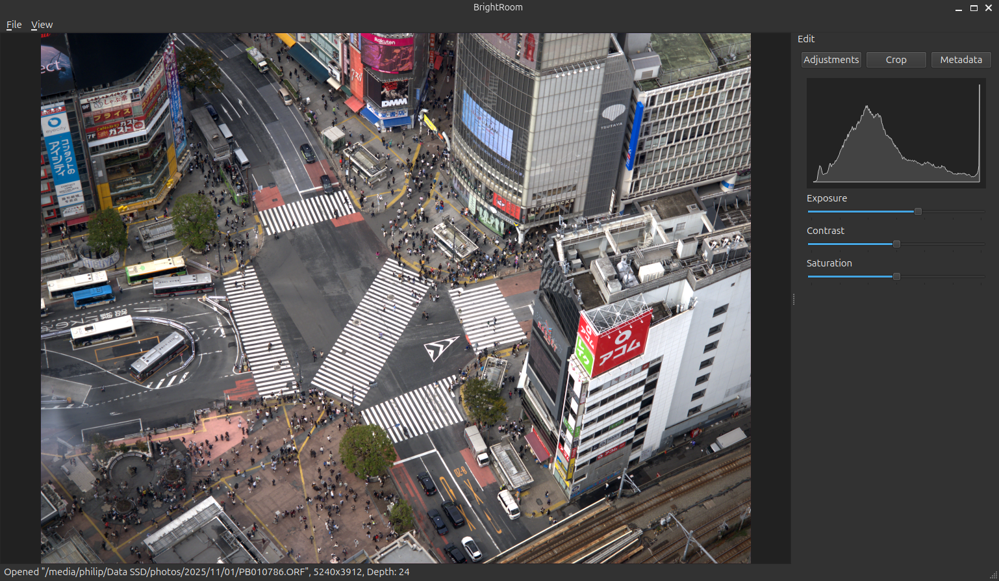

# BrightRoom



**BrightRoom** is a fast, modern editor for camera **RAW image files**. RAW files preserve the full sensor data captured by a digital camera, enabling significantly more flexible and higher‑quality editing than JPEG images.

BrightRoom focuses on performance, correctness, and a clean editing pipeline, making it a solid foundation for experimenting with RAW development techniques as well as building a full‑featured photo editor.

---

## Features

* Native editing of camera RAW files
* High‑performance image processing pipeline
* Responsive, cross‑platform GUI
* Modular architecture designed for future extensions

Built on proven open‑source technology:

* **LibRaw** – reading RAW data from many camera manufacturers
* **Qt** – cross‑platform graphical user interface
* **Halide** – high‑performance image processing

---

## Requirements

* **CMake** (tested with 3.28.3)
* **Clang** (tested with 18.1.3)

> Other modern compilers *may* work, but Clang is currently the recommended and tested toolchain.

---

## Building BrightRoom

```bash
git clone https://github.com/philipzimmermann/BrightRoom
cd BrightRoom
git submodule update --init
mkdir build
cd build
cmake ..
make  # First build also compiles LibRaw and may take a few minutes
./brightroom
```

---

## Project Status

BrightRoom is under active development and not yet feature‑complete. Expect breaking changes and incomplete functionality.

---

## Roadmap

Completed:

* Add histogram ✅
* Fix pink highlight artifacts
  (see: [https://www.odelama.com/photo/Developing-a-RAW-Photo-by-hand/#thestrangecaseofpinkishhighlights](https://www.odelama.com/photo/Developing-a-RAW-Photo-by-hand/#thestrangecaseofpinkishhighlights)) ✅
* Add worker thread ✅

Planned:

* Detect and handle black border areas for Canon files
* Add additional editing modules
* Cropping support
* Metadata view
* Library / image management view

---

## Contributing

Contributions, experiments, and discussions are welcome. If you’re interested in RAW processing, performance‑oriented image pipelines, or UI design for creative tools, feel free to open an issue or submit a pull request.

---

## License

This project uses third‑party open‑source libraries; see their respective licenses for details. BrightRoom’s license information can be found in the repository.
